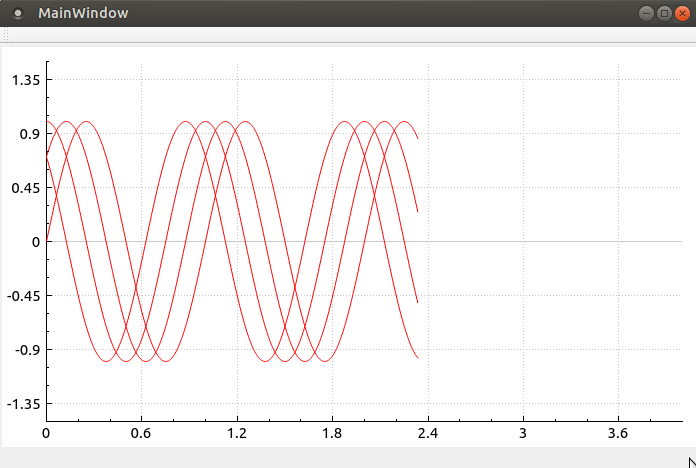

# Real Time Plot

This example aims to demonstrate how to buid a Real Time Plot
application using QCustomPlot library to Qt.

Real Time Plot using Qt5.0 + QCustomPlot library.

QCustomPlot library can be found in the following link: http://www.qcustomplot.com/index.php/introduction

## Example

