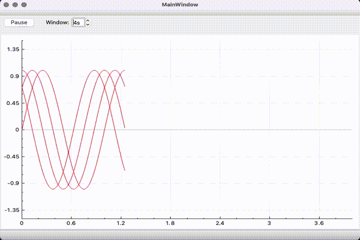

# Real Time Plot

This project provides Qt/C++ primitives to ease building real time plot UI.

# Dependencies

* Qt >= 5.11
* [QCustomPlot](http://www.qcustomplot.com/index.php/introduction) (included in this repo)
* Gcc >= 6
   
# How to Use

Place the folders *realtimeplot* and *QCustoPlot* inside your Qt project folder. The folder *realtimeplot* contains the primitives, and the folder *QCustomPlot* is the 3rd party library of same name.
You might need to add the folder *realtimeplot* to the **INCLUDEPATH**, otherwise you'll face errors generating the *plot.ui* c++ class. 

```make
QT       += core gui printsupport

greaterThan(QT_MAJOR_VERSION, 4): QT += widgets

TARGET = realTimePlot
TEMPLATE = app

CONFIG += c++17

INCLUDEPATH += realtimeplot

SOURCES += main.cpp\
        mainwindow.cpp \
        QCustomPlot/qcustomplot.cpp \ 
        realtimeplot/plotarea.cpp \
        realtimeplot/pointstream.cpp

HEADERS  += mainwindow.h \
            QCustomPlot/qcustomplot.h \
            realtimeplot/plotarea.h \
            realtimeplot/pointstream.h

FORMS    += mainwindow.ui \
            realtimeplot/plotarea.ui

```

### The UI element *PlotArea* 

*PlotArea* is an UI component that inherits the class *QCustomPlot* and provides Real Time Plot similar to an Oscilloscope.

You might want to see the QCustomPlot documentation to see what features it provides by default. Fell free to customize or subclass *PlotArea* as needed.

## Example

This example instantiates a fixed number of curves, each one backed by its own stream of points. The curves are added to the same *PlotArea* as you can notice in the *MainWindow*'s constructor.

We simulate a real-time stream of points in the **timerEvent** handler, which runs at the periodicity of **SAMPLE_GENERATION_PERIOD**.

You can check the file MainWindow.ui to see how we placed the **PlotArea** component to the MainWindow. However, if you need a more dynamic layout I recomment you to instantiate it programmatically, so you can have full control over the layout.

```c++
#include "mainwindow.h"
#include "ui_mainwindow.h"

#include <QDebug>
#include <qmath.h>

#define POINT_STREAM_NUM 4

MainWindow::MainWindow(QWidget *parent) :
    QMainWindow(parent),
    ui(new Ui::MainWindow)
{
    ui->setupUi(this);

    for(int i=0; i<POINT_STREAM_NUM; i++) {
        QSharedPointer<PointStream> stream(new PointStream());
        stream->setSamplesPerSeconds(1000/SAMPLE_GENERATION_PERIOD);
        dataPoints << stream;
        ui->plotArea->addPointStream(stream);
    }

    ui->plotArea->setWindowLengthInSeconds(4.0);

    startTimer(SAMPLE_GENERATION_PERIOD);
}

MainWindow::~MainWindow()
{
    delete ui;
}

void MainWindow::timerEvent(QTimerEvent *event)
{
    Q_UNUSED(event)

    constexpr double twoPi = 2.0*M_PI;
    constexpr double freq = 1.0; // 2Hz
    const double samplePeriod = 
        static_cast<double>(SAMPLE_GENERATION_PERIOD)/1000.0;

    for(int i=0; i<dataPoints.size(); i++) {
        double phase = (i*M_PI)/dataPoints.size();
        double value = qSin(phase + twoPi*freq*sampleNumber*samplePeriod);
        //qDebug() << sampleNumber << value;
        QVector<QPointF> data;
        data << QPointF(sampleNumber, value);
        dataPoints.at(i)->appendPoints(data);
    }

    sampleNumber++;
}

```



## TODO

* Implement Circular Buffer
* Optimize the class **Poitstream** to use Circular Buffer
* Implement GraphFactory to handle CGraph Style
